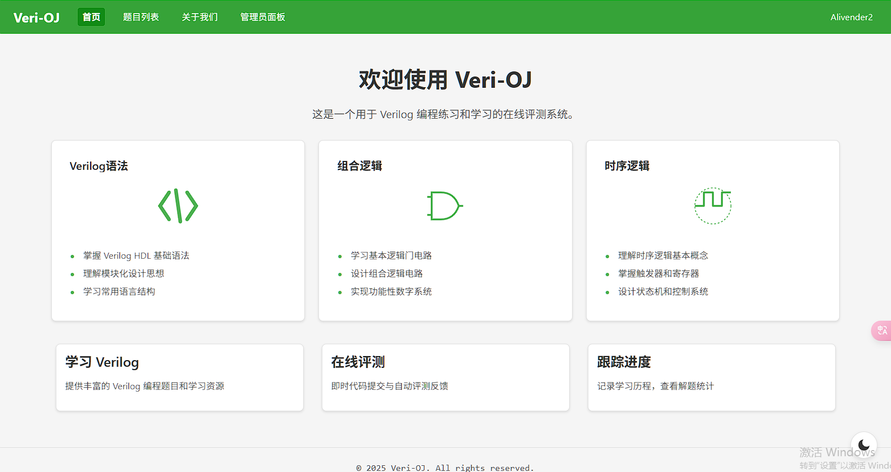
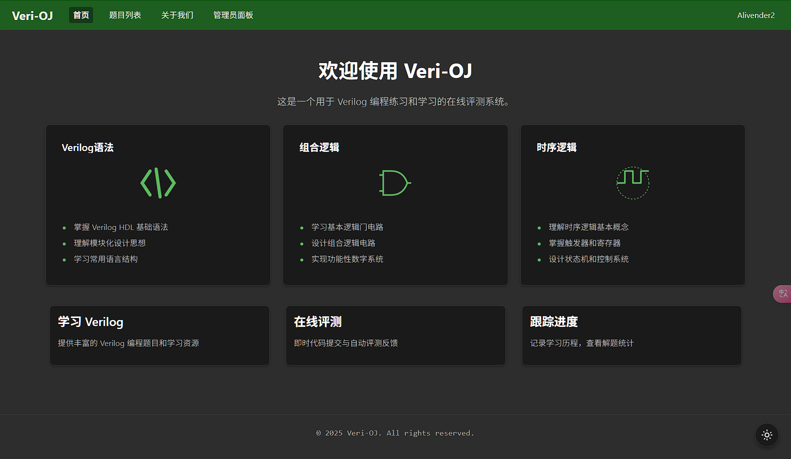
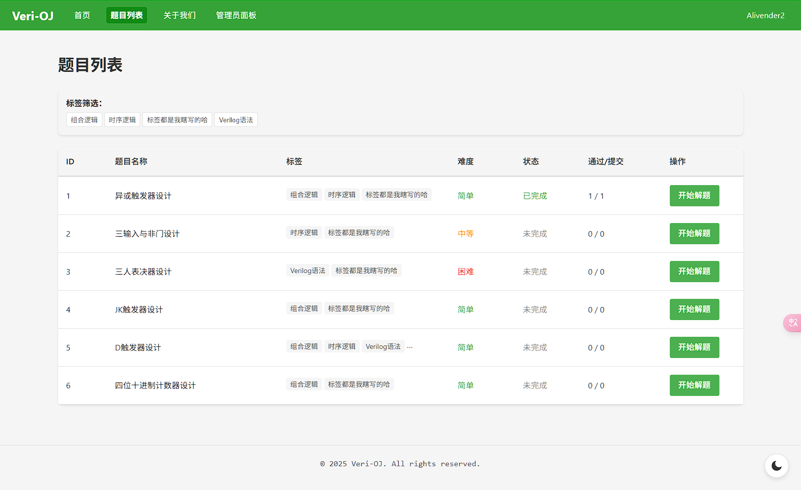
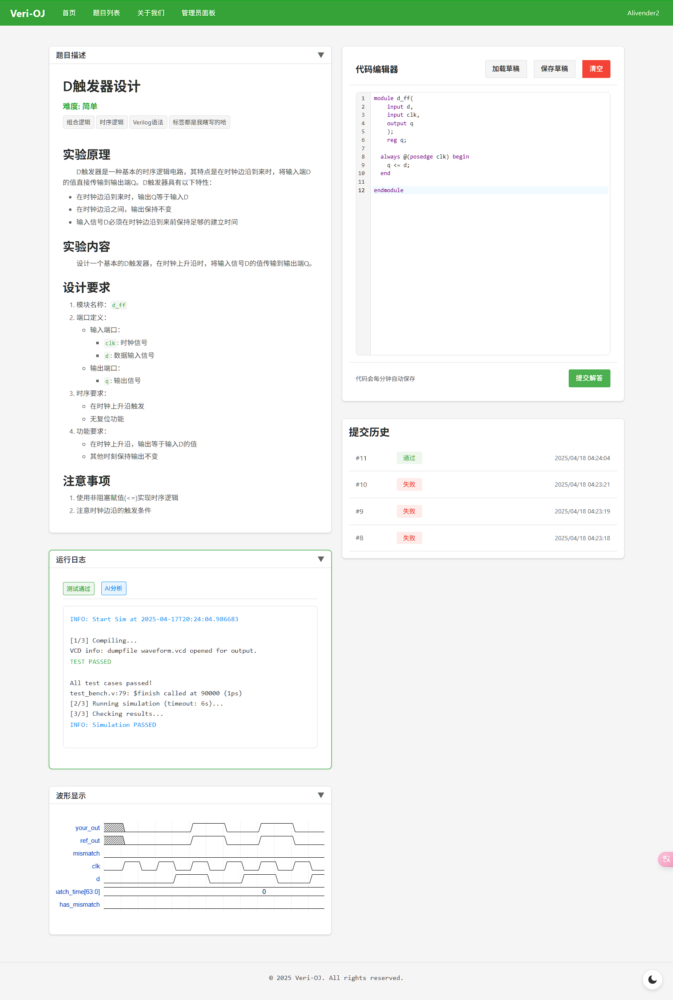
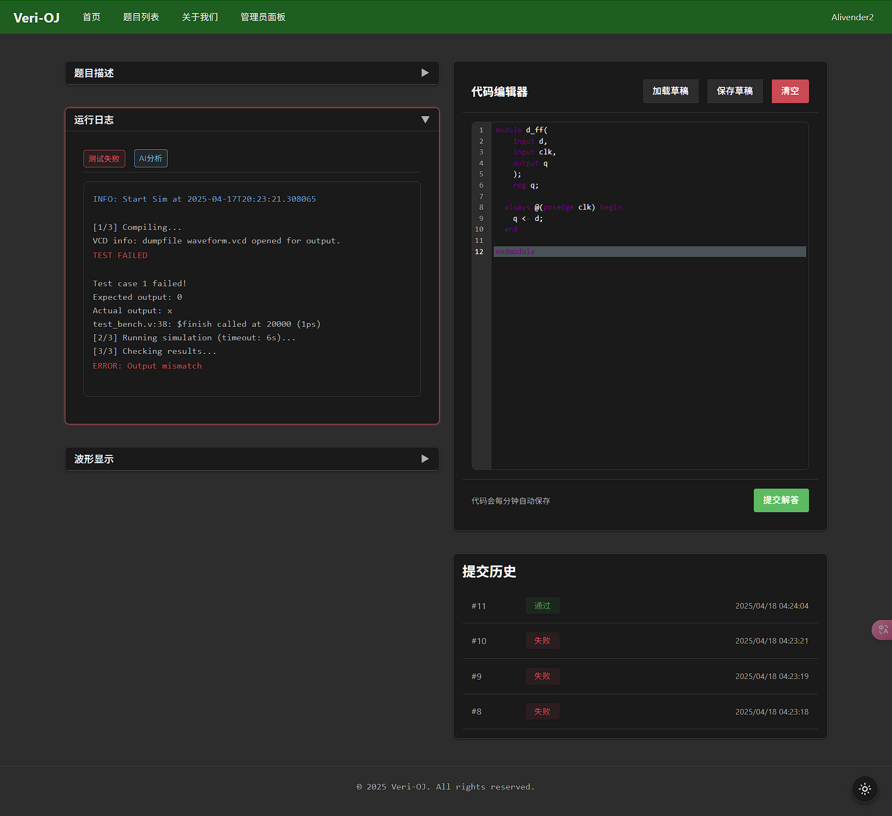
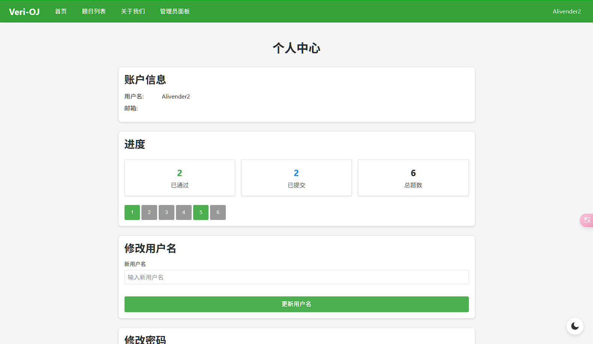

# Verilog 在线评测系统

这是一个前端基于 Vue 3 + Vite ，后端基于 Flask 框架，判题部分采用 iverilog + Queue 队列管理的 Verilog 在线评测系统。

系统允许用户提交 Verilog 代码并自动评测结果。系统还集成了基于deepseek的智能分析功能，可以对代码提交结果进行智能分析和建议。

## [前端 README](frontend/README.md)

## [后端 README](backend/README.md)

## [api文档](api.md)