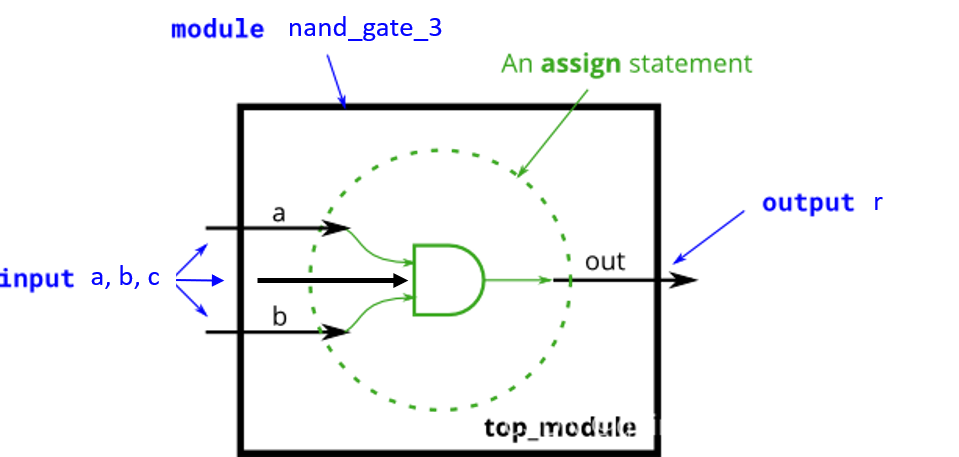

# 异或触发器设计

## 实验原理
异或触发器是一种基本的时序逻辑电路，其输出与输入信号和当前状态有关。当时钟上升沿到来时，输出信号等于输入信号与当前输出信号的异或结果。

## 实验内容
### 任务描述
设计一个带异步复位的异或触发器，在时钟上升沿时，输出信号等于输入信号与当前输出信号的异或结果。复位信号为低电平有效。

### 设计要求

1. 模块名称：`xor_trigger`
2. 端口定义：
   - 输入端口：
     - `clk`: 时钟信号
     - `rstn`: 异步复位信号，低电平有效
     - `in`: 输入信号
   - 输出端口：
     - `out`: 输出信号
3. 时序要求：
   - 在时钟上升沿触发
   - 异步复位，低电平有效
4. 功能要求：
   - 复位时输出信号置0
   - 非复位状态下，在时钟上升沿时，输出等于输入与当前输出的异或结果

## 注意事项
1. 注意复位信号为低电平有效
2. 确保在时钟上升沿触发
3. 注意异步复位的实现方式